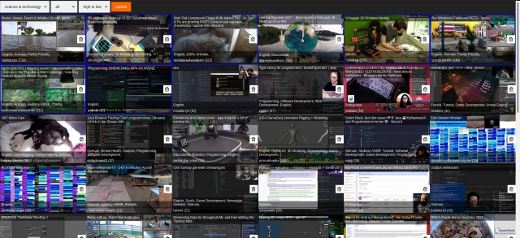

# Twitch search dashboard
<br/>


<strong>Features:</strong>
* sort types: recent, high to low
* block streams (without login)
* blue border indicates partner streams

## How to use it

Install node modules:
```
npm i
```

run node script
```
npm run start
```

Open `http://127.0.0.1:3000` in your browser

## Block list

You can use the little trashcan icon to block a user in the streamlist.
Blocked streams will be added to `blockList.json`. If you want to "unban" someone then you can remove the name from that file and restart the node script.

## Add more channels

Simple add the channel name as an `<option>` to the channel selector
