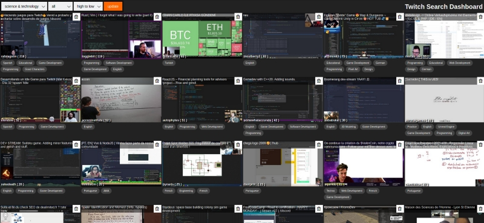
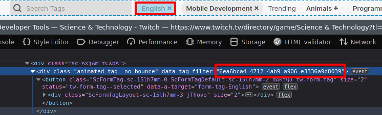

# Twitch search dashboard
> Be the first viewer - say hi!

<br/>


## Features:
#### Sort all channels by recent or high to low
Quickly sort a channel by the start time (even 'Just chatting') or from high to low viewer count.
You can also filter by a language tag.

#### Block streams without a login
If you want to clean up your stream list you can click on the little trashcan icons to remove the stream from appearing in the list.

#### See partner streams
A partner stream is indicated by a blue border around the image.

## How to use it

Clone the repo
```bash
git clone --depth 1 https://github.com/m1ga/twitch_search_dashboard
```

Install node modules:
```bash
npm i
```

run node script
```bash
npm run start
```

Open `http://127.0.0.1:3000` in your browser

## Block list

You can use the little trashcan icon to block a user in the streamlist.
Blocked streams will be added to `blockList.json`. If you want to "unban" someone then you can remove the name from that file and restart the node script.

## Add more channels/languages

If you want to add another channel or language/tag you can do that by adding `<option>` elements into the `index.html`. For a new channel you can simply add them here: https://github.com/m1ga/twitch_search_dashboard/blob/master/index.html#L24-L27

To add a new language/tag you will need to find the tag id on the twitch page. To do that you add the tag to a search and use the DevTools (F12) and select the tag:
<br>
search for `data-tag-filter` and add the value to the tag filter:
Simple add the channel name as an `<option>` to the channel selector https://github.com/m1ga/twitch_search_dashboard/blob/master/index.html#L22-L26
